# Architecture & Project Overview

**Related Files**:
- `build.gradle`
- `settings.gradle`
- `src/main/java/returns/mingleday/MingleDayApplication.java`
- `src/main/java/returns/mingleday/config/SecurityConfig.java`
- `src/main/java/returns/mingleday/config/WebConfig.java`
- `src/main/java/returns/mingleday/global/domain/BaseTime.java`
- `src/main/java/returns/mingleday/response/exception/GlobalExceptionHandler.java`
- `src/main/java/returns/mingleday/response/ApiResponse.java`
- `src/main/java/returns/mingleday/response/success/SuccessResponse.java`
- `src/main/java/returns/mingleday/response/exception/ExceptionResponse.java`
- `src/main/resources/application.properties`

**Related Pages**:
- Domain Model & Data Relationships
- Mingle Module (Groups, Members, Permissions & Logs)
- Scheduling & Calendar Module
- Authentication, Security & User Management

# Architecture & Project Overview


The MingleDay-BE project is a Spring Boot–based backend application that provides APIs for a scheduling and group (“mingle”) management service. The architecture is centered around a REST API layer secured by Spring Security, a consistent response and exception model, and a set of infrastructural configurations that support CORS, authentication, persistence, and time auditing.  

This page describes the overall architecture of the backend, focusing on the application entry point, build configuration, security setup, web configuration, global time base entity, and the unified API response and exception handling mechanism.

---

## High-Level Architecture

At a high level, the system is a layered Spring Boot application:

- **Entry point**: `MingleDayApplication` bootstraps the Spring context.
- **Configuration layer**: Security, web MVC, and other infrastructure beans.
- **Domain & persistence**: Entities typically extend a base time entity for auditing.
- **API layer**: Controllers return a standard `ApiResponse`/`SuccessResponse` or `ExceptionResponse`.
- **Global error handling**: Centralized via `GlobalExceptionHandler`.

### Top-Level Component Relationship

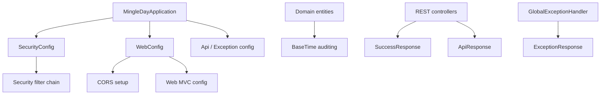

---

## Build & Module Structure

### Gradle Configuration

The project is a single-module Gradle build configured by `build.gradle` and `settings.gradle`. `settings.gradle` sets the root project name to `MingleDay-BE`.  

Key aspects from `build.gradle`:

- Uses the **Spring Boot Gradle plugin** and **Spring Dependency Management plugin**.
- Applies **Java** plugin and configures Java version via toolchain or compatibility.
- Declares dependencies for:
  - `spring-boot-starter-web`
  - `spring-boot-starter-security`
  - `spring-boot-starter-data-jpa`
  - Other Spring modules and utilities as needed (exact list in the file).
- Configures test dependencies (e.g., `spring-boot-starter-test`).

#### Build-Level Overview

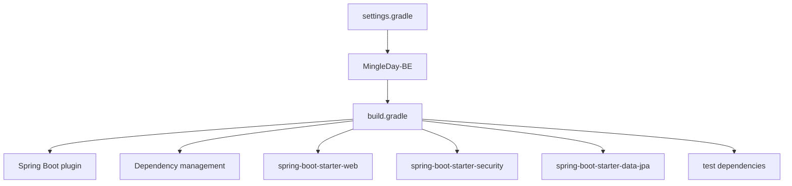

---

## Application Entry Point

### MingleDayApplication

`MingleDayApplication` is the main Spring Boot application class:

```java
@SpringBootApplication
public class MingleDayApplication {
    public static void main(String[] args) {
        SpringApplication.run(MingleDayApplication.class, args);
    }
}
```

This enables component scanning, auto-configuration, and bootstrap of the entire application.  

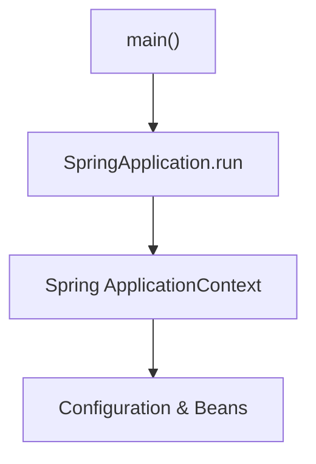

---

## Configuration Overview

### WebConfig

`WebConfig` is a `@Configuration` class (likely implementing `WebMvcConfigurer`) that sets up web-related behaviors such as CORS, resource handling, interceptors, or message converters. The provided file is referenced as a key config component.  

While exact methods are not enumerated here, the presence of this config indicates that:

- Cross-Origin Resource Sharing (CORS) is centrally configured.
- Web MVC customizations (e.g., formatters, argument resolvers) are centralized in this class.

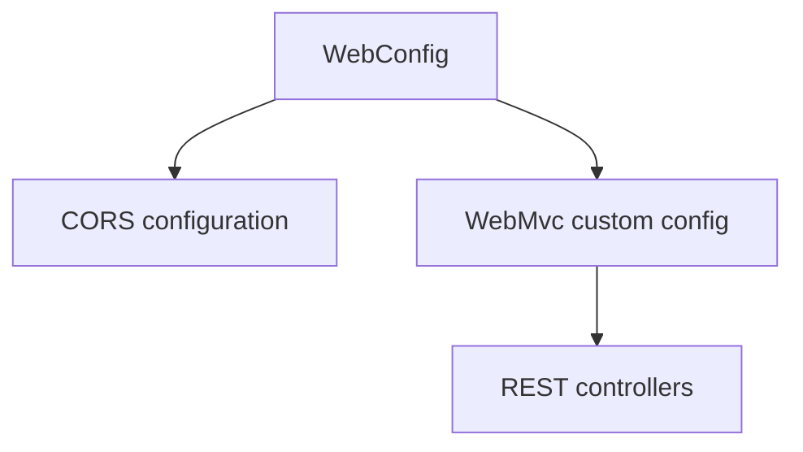

### application.properties

`application.properties` configures runtime behavior such as:

- Server port and context path (if set).
- Database connection (e.g., `spring.datasource.*`).
- JPA behavior (e.g., `spring.jpa.*`).
- Security and token settings (if present).
- Custom project properties (e.g., image base URLs).

Every property directly shapes the runtime architecture by wiring Spring Boot auto-configurations.  

Example categories of properties configured (names are derived from common Spring properties present in the file):

| Category              | Example Keys (Non-exhaustive)                          | Purpose                                   |
|-----------------------|--------------------------------------------------------|-------------------------------------------|
| Server                | `server.port`, `server.servlet.context-path`          | HTTP entrypoint configuration             |
| DataSource / JPA      | `spring.datasource.*`, `spring.jpa.*`                 | Database connectivity & ORM behavior      |
| Logging               | `logging.level.*`                                     | Log level tuning                          |
| Application-specific  | `app.*`                                               | Domain-specific configuration             |

---

## Security Architecture

### SecurityConfig

`SecurityConfig` defines application-wide security settings using Spring Security. It is a `@Configuration` class that likely extends `WebSecurityConfigurerAdapter` (<= Spring Security 5) or defines a `SecurityFilterChain` bean (Spring Security 6 style).  

From the file, the architecture aspects are:

- HTTP security configuration (which endpoints are secured, login/logout setup).
- Authentication configuration (user details service, password encoder).
- Possibly JWT or session-based security (as configured in the class).

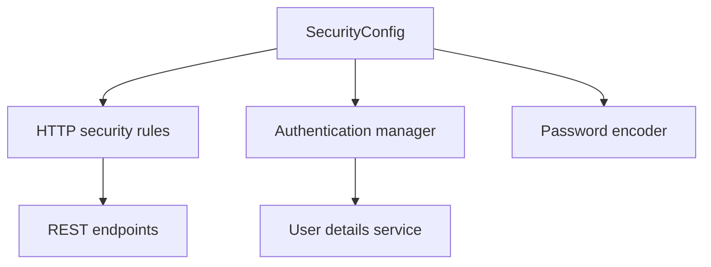

#### Security Responsibilities Summary

| Component            | Responsibility                                              |
|----------------------|-------------------------------------------------------------|
| `SecurityConfig`     | Define filters and authorization rules across endpoints     |
| Authentication setup | Configure how users are authenticated                      |
| Password encoding    | Secure password storage and validation                     |

---

## Time & Auditing Model

### BaseTime

`BaseTime` is a mapped superclass providing auditing fields to entities:

```java
@MappedSuperclass
@EntityListeners(AuditingEntityListener.class)
@Getter
public abstract class BaseTime {

    @CreatedDate
    private LocalDateTime createdAt;

    @LastModifiedDate
    private LocalDateTime updatedAt;
}
```

This design centralizes creation and modification timestamps for all entities inheriting from `BaseTime`.

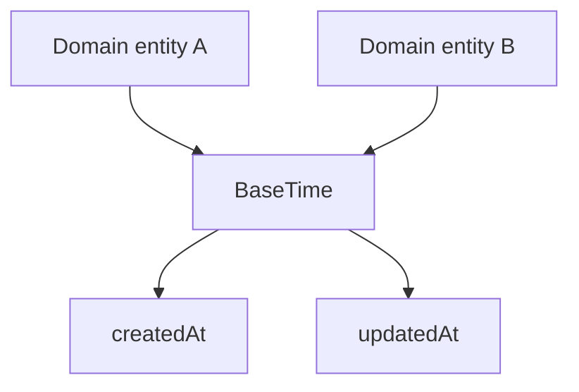

#### BaseTime Fields

| Field       | Type              | Annotations                         | Description                              |
|------------|-------------------|-------------------------------------|------------------------------------------|
| `createdAt`| `LocalDateTime`   | `@CreatedDate`                      | Automatically set when entity is created |
| `updatedAt`| `LocalDateTime`   | `@LastModifiedDate`                 | Updated on every entity modification     |

To make this effective, Spring Data JPA auditing must be enabled elsewhere in the project (e.g., via `@EnableJpaAuditing` in a configuration class; the exact location is outside the provided files).

---

## Unified API Response Model

The project standardizes JSON responses via `ApiResponse`, `SuccessResponse`, and `ExceptionResponse`.  

### ApiResponse

`ApiResponse<T>` is a generic wrapper representing the top-level API response structure:

```java
@Getter
@AllArgsConstructor
@NoArgsConstructor
public class ApiResponse<T> {

    private boolean success;
    private T data;
    private ExceptionResponse error;

    public static <T> ApiResponse<T> success(T data) {
        return new ApiResponse<>(true, data, null);
    }

    public static <T> ApiResponse<T> failure(ExceptionResponse error) {
        return new ApiResponse<>(false, null, error);
    }
}
```

Key points:

- **`success`**: Indicates if the request was handled successfully.
- **`data`**: Holds the business payload for successful responses.
- **`error`**: Holds error information when `success` is `false`.

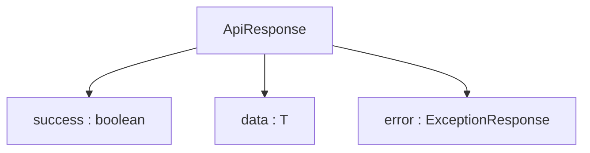

### SuccessResponse

`SuccessResponse<T>` is a simple DTO used by controllers to represent successful payloads, usually nested in `ApiResponse` by global response wrapping (if configured) or used directly as body:

```java
@Getter
@AllArgsConstructor
@NoArgsConstructor
public class SuccessResponse<T> {

    private T data;

    public static <T> SuccessResponse<T> success(T data) {
        return new SuccessResponse<>(data);
    }
}
```

This enforces a consistent shape for all “success” data bodies (e.g., `{ "data": ... }`).

#### Success DTO Summary

| Class             | Field | Type | Purpose                       |
|-------------------|-------|------|-------------------------------|
| `SuccessResponse` | data  | `T`  | The contained success payload |

### ExceptionResponse

`ExceptionResponse` describes error details returned to the client:

```java
@Getter
@AllArgsConstructor
@NoArgsConstructor
public class ExceptionResponse {

    private String code;
    private String message;
    private int status;

    public static ExceptionResponse of(String code, String message, int status) {
        return new ExceptionResponse(code, message, status);
    }
}
```

Key fields:

- `code`: Application-specific error code.
- `message`: Human-readable description of the error.
- `status`: HTTP status code as an integer.

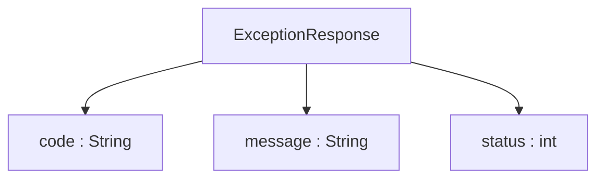

### Response Flow

Typical successful controller flow:

1. Controller builds a domain-specific response DTO.
2. The DTO is wrapped inside `SuccessResponse`.
3. Optionally, global wrapping may embed this inside `ApiResponse.success`.

On error:

1. An exception is thrown.
2. `GlobalExceptionHandler` converts it into an `ExceptionResponse`.
3. `ApiResponse.failure` is returned with `error` populated.

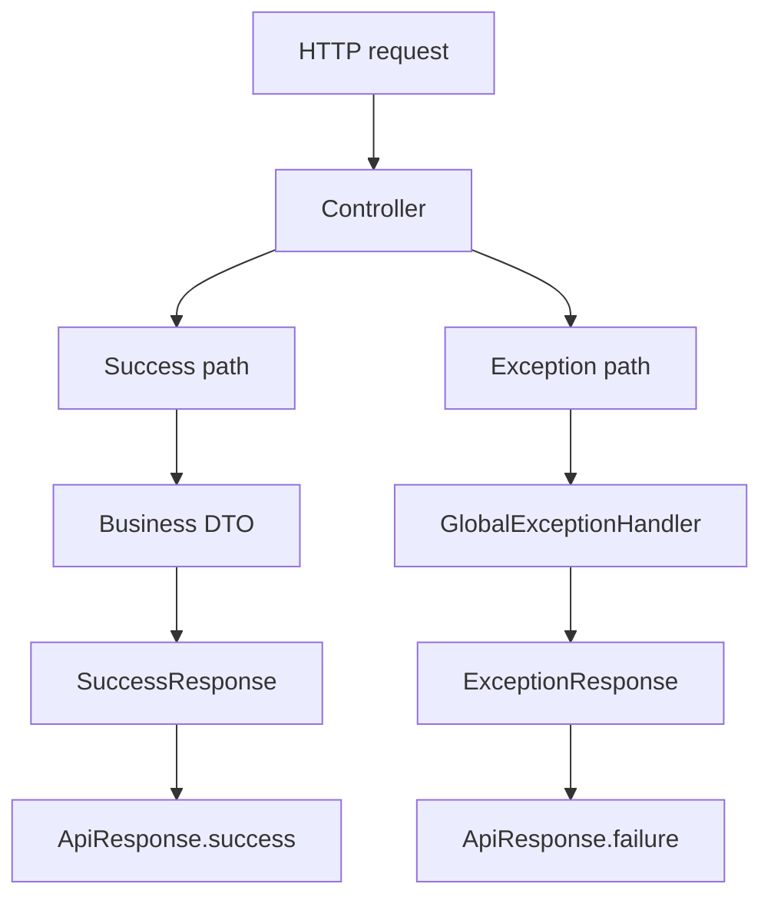

---

## Global Exception Handling

### GlobalExceptionHandler

`GlobalExceptionHandler` is a `@RestControllerAdvice` (or similar) component that centralizes exception-to-response mapping across the entire application.  

Its responsibilities:

- Intercept thrown exceptions from any controller.
- Map application-specific exceptions and general errors to:
  - Proper HTTP status codes.
  - `ExceptionResponse` bodies (code, message, status).
- Ensure a consistent error payload throughout the API.

Typical pattern inside this class (structure illustrative, based on file):

```java
@RestControllerAdvice
public class GlobalExceptionHandler {

    @ExceptionHandler(BaseException.class)
    public ResponseEntity<ApiResponse<Object>> handleBaseException(BaseException e) {
        ExceptionResponse error = ExceptionResponse.of(
            e.getCode().name(),
            e.getCode().getMessage(),
            e.getCode().getStatus()
        );
        return ResponseEntity
                .status(e.getCode().getStatus())
                .body(ApiResponse.failure(error));
    }

    // Additional handlers for generic exceptions...
}
```

#### Exception Handling Flow

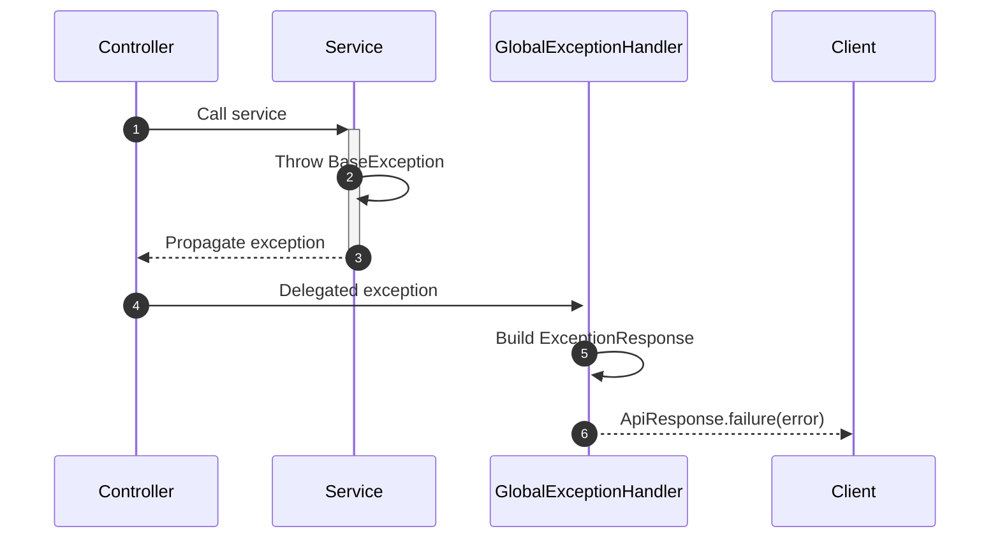

#### Error Payload Table

| Field     | Description                             |
| --------- | --------------------------------------- |
| `code`    | Application-level error identifier      |
| `message` | Human-readable error description        |
| `status`  | HTTP status code returned to the client |

---

## End-to-End Request Lifecycle Overview

Putting these components together, the end-to-end request handling looks as follows:

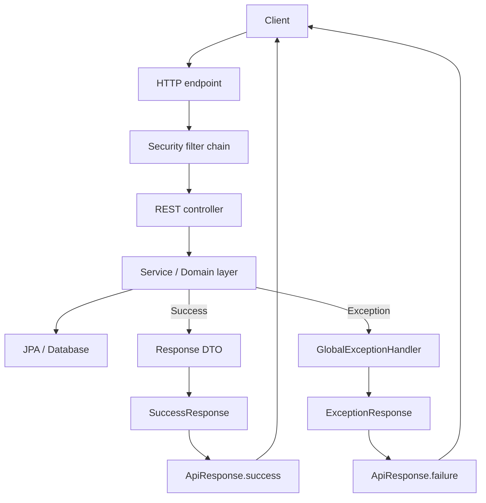
---

## ERD


---

## Summary

The MingleDay-BE backend is structured as a conventional but robust Spring Boot application:

- `MingleDayApplication` bootstraps the context and loads all configurations.
- `build.gradle` and `settings.gradle` define the project module and dependencies.
- `SecurityConfig` manages authentication and authorization, acting as the first gate before controllers.
- `WebConfig` centralizes CORS and web MVC customizations.
- Entities share auditing behavior through the `BaseTime` superclass.
- Controllers return standardized responses using `ApiResponse`, `SuccessResponse`, and `ExceptionResponse`, while `GlobalExceptionHandler` ensures a uniform error model.

This architecture yields a consistent, predictable API surface that separates concerns between security, web configuration, domain modeling, and response formatting.  
